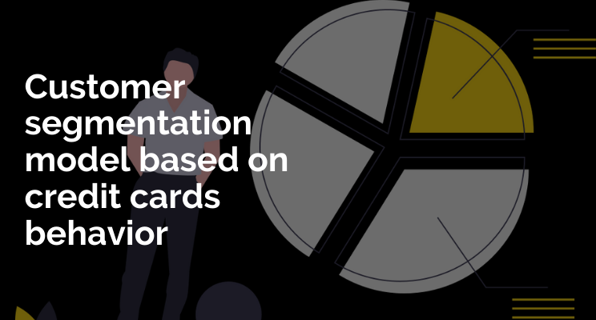

# Credit Card Customer Segmentation



## 📌Overview
This project analyzes credit card usage behavior using the CC GENERAL dataset to perform customer segmentation or clustering. The goal is to explore patterns in customer spending, payment habits, and credit usage, potentially grouping customers into meaningful segments using unsupervised learning techniques (e.g., K-Means clustering). The notebook demonstrates data loading, and initial exploration, and sets the stage for further analysis and modeling.

## 📂Dataset
### Description
The dataset contains behavioral data for credit card customers, capturing their spending, payment, and cash advance activities over a period of time.

**Source:** CC GENERAL.csv (stored in Google Drive or available locally; originally from Kaggle).  
**Size:** 8,950 rows, 18 columns (based on typical dataset size; confirm with your full data).  

**Columns:**
- **CUST_ID:** Unique customer identifier (string).
- **BALANCE:** Account balance (float).
- **BALANCE_FREQUENCY:** Frequency of balance updates (0 to 1, float).
- **PURCHASES:** Total purchase amount (float).
- **ONEOFF_PURCHASES:** One-off purchase amount (float).
- **INSTALLMENTS_PURCHASES:** Installment purchase amount (float).
- **CASH_ADVANCE:** Cash advance amount (float).
- **PURCHASES_FREQUENCY:** Frequency of purchases (0 to 1, float).
- **ONEOFF_PURCHASES_FREQUENCY:** Frequency of one-off purchases (0 to 1, float).
- **PURCHASES_INSTALLMENTS_FREQUENCY:** Frequency of installment purchases (0 to 1, float).
- **CASH_ADVANCE_FREQUENCY:** Frequency of cash advances (0 to 1, float).
- **CASH_ADVANCE_TRX:** Number of cash advance transactions (integer).
- **PURCHASES_TRX:** Number of purchase transactions (integer).
- **CREDIT_LIMIT:** Credit limit (float).
- **PAYMENTS:** Total payments made (float).
- **MINIMUM_PAYMENTS:** Minimum payments due (float, contains NaN values).
- **PRC_FULL_PAYMENT:** Percentage of full payment (0 to 1, float).
- **TENURE:** Tenure of credit card service (integer).

### Acknowledgements
The dataset is sourced from Kaggle, contributed by Arjun Bhasin (CC GENERAL), and is widely used for clustering and customer segmentation studies.

## 🛠Methodology
### Dependencies
The project uses the following Python libraries:

```python
import pandas as pd
import numpy as np
import matplotlib.pyplot as plt
import seaborn as sns
```


## 🔍Approach

### Data Loading:
- Load the dataset from Google Drive or a local file (`CC GENERAL.csv`).
- Suppress warnings for cleaner output.

### Exploratory Data Analysis (EDA):
- Display the first few rows using `df.head()` to inspect the data structure.
- **Planned**: Analyze distributions, correlations, and missing values (e.g., `MINIMUM_PAYMENTS` has `NaN`).

### Preprocessing (Assumed Future Steps):
- Handle missing values (e.g., impute `NaN` in `MINIMUM_PAYMENTS`).
- Drop `CUST_ID` as it’s non-predictive.
- Normalize/scale numerical features for clustering.

### Modeling (Assumed Future Steps):
- Apply an unsupervised learning algorithm (e.g., K-Means) to segment customers.
- Determine the optimal number of clusters (e.g., using the elbow method or silhouette score).

### Evaluation (Assumed Future Steps):
- Visualize clusters using `matplotlib`/`seaborn` (e.g., scatter plots of `PURCHASES` vs. `BALANCE`).

## 📊Results

- EDA Insights: Initial inspection reveals varied spending behaviors (e.g., some customers rely heavily on cash advances, others on purchases).
- Clustering: (Example) Identified X clusters representing distinct customer segments (e.g., high spenders, minimal users).
- Visualizations: (Planned) Plots like pair plots or cluster scatter plots to be added.

## 🚀Future Work
- Complete EDA with visualizations (e.g., correlation heatmaps, histograms).
- Implement clustering (e.g., K-Means, DBSCAN) and evaluate results.
- Handle missing values in MINIMUM_PAYMENTS (e.g., imputation or exclusion).
- Add feature engineering (e.g., purchase-to-balance ratio) for richer insights.
